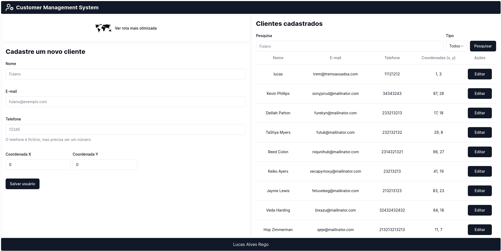

# CUSTOMER MANAGEMENT SYSTEM - TRAVELING SALESMAN PROBLEM



OBS: Apesar do commit inicial ter sido feito no dia 07/02/2024, o projeto foi iniciado no dia 03/02/2024.

## Requisitos do sistema

- Node v21.4.0
- PNPM 8.12.1
- Docker 25.0.12
- Docker Compose 1.29.2

## Instalação

1. Clone o repositório
2. Execute o comando `pnpm install` na raiz do projeto
3. Execute o comando `docker-compose up` na raiz do projeto
4. Acesse o endereço `http://localhost:3000` no seu navegador

## Testando

1. Execute o comando `pnpm test` na raiz do projeto

## DDL

```sql
CREATE TABLE customer (
  name VARCHAR(255) NOT NULL,
  email VARCHAR(255) NOT null PRIMARY key,
  phone VARCHAR(255) NOT NULL,
  location_x FLOAT NOT NULL,
  location_y FLOAT not null,
  search tsvector
);

CREATE INDEX search_index ON customer USING GIN(search);
```

## Descrição

O sistema foi desenvolvido para gerenciar clientes de uma empresa. O sistema é capaz de cadastrar, editar, e buscar clientes. Além disso, o sistema é capaz de calcular a rota mais curta para visitar todos os clientes cadastrados.
